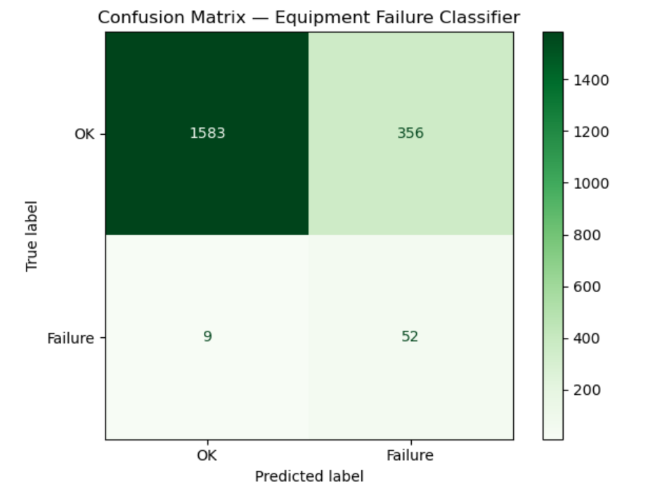
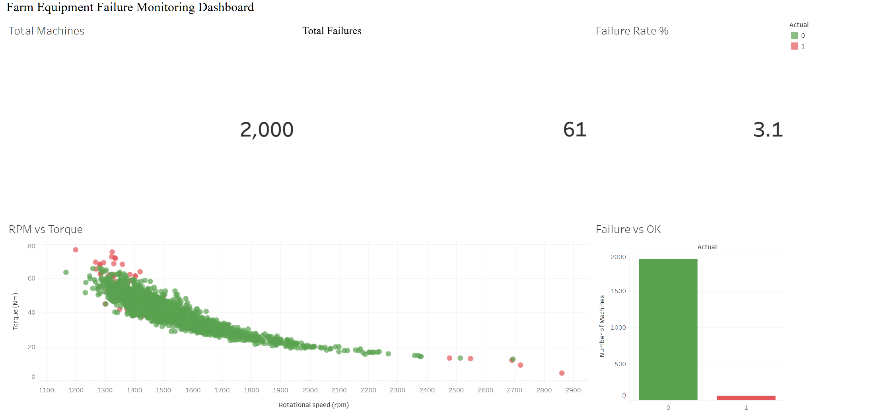

# 🚜 Farm Equipment Maintenance Predictor

A machine learning + Tableau project that predicts whether industrial farm equipment needs maintenance based on real-time sensor readings — directly relevant to predictive maintenance systems used in precision agriculture.

🔗 **[View Live Tableau Dashboard](https://public.tableau.com/app/profile/prasidham.sinha/viz/farm_eqp_failure_dashboard/Dashboard1)**

---

## 📌 Business Problem

Unplanned equipment failure during harvest season can cost farmers thousands of dollars per day. Early detection using on-board sensor data allows maintenance teams to act **before** a breakdown happens — not after.

This project uses a real-world industrial sensor dataset (AI4I 2020) to build a binary classifier that flags machines at risk of failure, paired with an operational monitoring dashboard.

---

## 📊 Dataset

- **Source:** AI4I 2020 Predictive Maintenance Dataset (UCI Machine Learning Repository)
- **Rows:** 10,000 machine readings
- **Failure rate:** 3.4% — a real-world imbalanced classification problem

**Sensor features used:**

| Feature | Description |
|---|---|
| Air temperature [K] | Ambient air temperature |
| Process temperature [K] | Operating temperature of the machine |
| Rotational speed [rpm] | Speed of the rotating component |
| Torque [Nm] | Rotational force applied |
| Tool wear [min] | Minutes of tool usage since last replacement |

---

## 🔍 Exploratory Data Analysis

Boxplot analysis revealed that **Rotational Speed** and **Torque** had the most outliers — machines operating outside normal ranges in these sensors were most likely to fail.

---

## ⚙️ Approach

| Step | What I did |
|---|---|
| 1 | Loaded and explored the real AI4I dataset |
| 2 | Identified class imbalance (96.6% OK, 3.4% failure) |
| 3 | Split data 80/20 train/test |
| 4 | Scaled features using StandardScaler to prevent dominance |
| 5 | Trained Logistic Regression (baseline) |
| 6 | Identified accuracy paradox — 97% accuracy but only 26% recall |
| 7 | Fixed using class_weight='balanced' — recall improved to 85% |
| 8 | Built operational monitoring dashboard in Tableau |

---

## 📈 Key Insight — The Accuracy Paradox

My first model scored **97.3% accuracy** but only caught **26% of actual failures.**

Because 96.6% of machines are fine, a model that predicts "OK" for everything would score 96.6% accuracy without learning anything useful. **Accuracy is a misleading metric for imbalanced data.**

What actually matters here is **Recall** — out of all machines that truly failed, how many did we catch?

| | Model 1 (baseline) | Model 2 (balanced) |
|---|---|---|
| Accuracy | 97.3% | 82% |
| Recall (failures) | 26% | **85%** |
| Right for production? | ❌ | ✅ |

Missing a real failure = broken harvester in a field = massive cost.
A false alarm = unnecessary maintenance check = minor inconvenience.

**The tradeoff is clear — recall matters more than accuracy here.**

---

## 🔲 Confusion Matrix

| | Predicted OK | Predicted Failure |
|---|---|---|
| **Actually OK** | 1583 ✅ | 356 ⚠️ false alarms |
| **Actually Failing** | 9 ❌ missed | 52 ✅ caught |

Only **9 failing machines** slipped through undetected out of 61 total failures.

---

## 📊 Tableau Dashboard

An operational monitoring dashboard built to visualise model predictions alongside key fleet KPIs.

🔗 **[Open Interactive Dashboard](https://public.tableau.com/app/profile/prasidham.sinha/viz/farm_eqp_failure_dashboard/Dashboard1)**

**Dashboard includes:**
- KPI tiles — Total Machines, Total Failures, Failure Rate %
- Scatter plot — RPM vs Torque coloured by failure status (red = failure)
- Bar chart — OK vs Failure machine count

**Key visual insight:** Failures cluster in the top-left of the RPM vs Torque scatter plot — high torque + low RPM is a strong predictor of mechanical stress and failure risk.

---

## 💡 What I'd Do Next

- Try **Random Forest or XGBoost** to improve precision without losing recall
- Use **SMOTE** (synthetic oversampling) to handle class imbalance differently
- Connect dashboard to a **live data stream** for real-time fleet monitoring
- Add **time-series analysis** to predict failure X hours in advance

---

## ▶️ How to Run

1. Clone the repo
2. Install requirements: `pip install pandas numpy scikit-learn matplotlib`
3. Open `equipment_maintenance.ipynb` in Jupyter Notebook
4. Run all cells top to bottom

---

## 🛠️ Tools & Libraries

`Python` `Pandas` `NumPy` `Scikit-learn` `Matplotlib` `Tableau` `Jupyter Notebook`

---

*Built by Prasidham Sinha | [LinkedIn](https://linkedin.com/in/prasidham-sinha) | [GitHub](https://github.com/Disastermngmnt)*
